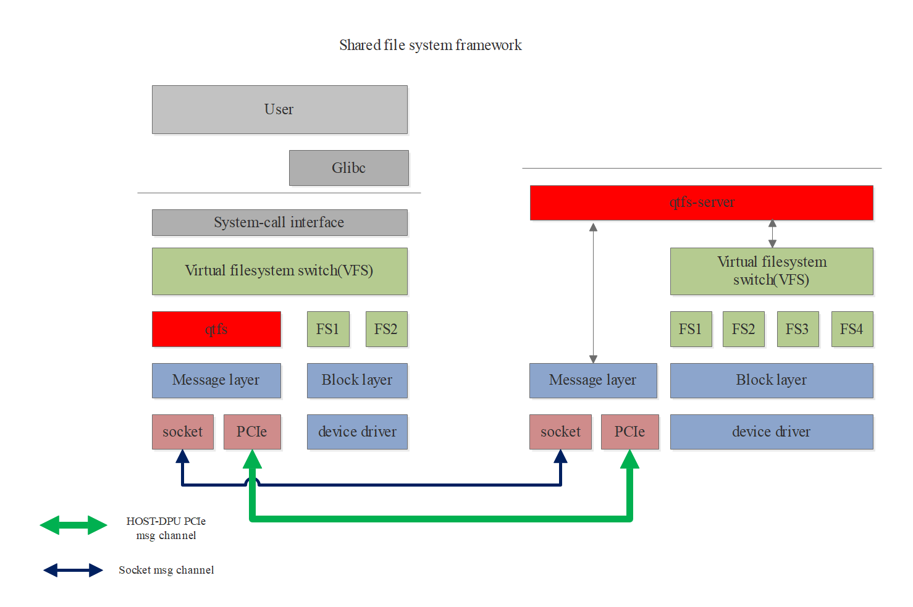

# qtfs

## 介绍

qtfs是一个共享文件系统项目，可部署在host-dpu的硬件架构上，也可以部署在2台服务器之间。以客户端服务器的模式工作，使客户端能通过qtfs访问服务端的指定文件系统，得到本地文件访问一致的体验。

qtfs的特性：

+ 支持挂载点传播；

+ 支持proc、sys、cgroup等特殊文件系统的共享；

+ 支持远程文件读写的共享；

+ 支持在客户端对服务端的文件系统进行远程挂载；

+ 支持特殊文件的定制化处理；

+ 支持远端fifo、unix-socket等，并且支持epoll，使客户端和服务端像本地通信一样使用这些文件；

+ 支持基于host-dpu架构通过PCIe协议底层通信，性能大大优于网络；

+ 支持内核模块形式开发，无需对内核进行侵入式修改。

## 软件架构

软件大体框架图：

## 安装教程

目录说明：

+ **qtfs**: 客户端内核模块相关代码，直接在该目录下编译客户端ko。

+ **qtfs_server**: 服务端内核模块相关代码，直接在该目录下编译服务端ko和相关程序。

+ **qtinfo**: 诊断工具，支持查询文件系统的工作状态以及修改log级别等。

+ **demo**、**test**、**doc**: 测试程序、演示程序以及项目资料等。

+ 根目录: 客户端与服务端通用的公共模块代码。

首先找两台服务器（或虚拟机）配置内核编译环境：

    1. 要求内核版本在5.10或更高版本。
    2. 安装内核开发包：yum install kernel-devel。

服务端安装：

    1. cd qtfs_server
    2. make clean && make
    3. insmod qtfs_server.ko qtfs_server_ip=x.x.x.x qtfs_server_port=12345 qtfs_log_level=WARN
    4. ./engine 4096 16

客户端安装：

    1. cd qtfs
    2. make clean && make
    3. insmod qtfs.ko qtfs_server_ip=x.x.x.x qtfs_server_port=12345 qtfs_log_level=WARN

## 使用说明

安装完成后，客户端通过挂载把服务端的文件系统让客户端可见，例如：

    mount -t qtfs / /root/mnt/

客户端进入"/root/mnt"后便可查看到server端的所有文件，以及对其进行相关操作。
