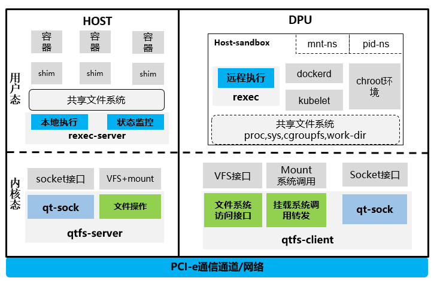

# 容器管理面无感卸载介绍

## 概述

在数据中心及云场景下，随着摩尔定律失效，通用处理单元CPU算力增长速率放缓，而同时网络IO类速率及性能不断攀升，二者增长速率差异形成的剪刀差，即当前通用处理器的处理能力无法跟上网络、磁盘等IO处理的需求。传统数据中心下越来越多的通用CPU算力被IO及管理面等占用，这部分资源损耗称之为数据中心税（Data-center Tax）。据AWS统计，数据中心税可能占据数据中心算力的30%以上，部分场景下甚至可能更多。

DPU的出现就是为了将这部分算力资源从主机CPU上解放出来，通过将管理面、网络、存储、安全等能力卸载到专有的处理器芯片（DPU）上进行处理加速，达成降本增效的结果。目前主流云厂商如AWS、阿里云、华为云都通过自研芯片完成管理面及相关数据面的卸载，达成数据中心计算资源100%售卖给客户。

管理面进程卸载到DPU可以通过对组件源码进行拆分达成，将源码根据功能逻辑拆分成独立运行的两部分，分别运行在主机和DPU，达成组件卸载的目的。但是这种做法有以下问题：一是影响组件的软件兼容性，组件后续版本升级和维护需要自己维护相关patch，带来一定的维护工作量；二是卸载工作无法被其他组件继承，后续组件卸载后仍需要进行代码逻辑分析和拆分等工作。为解决上述问题，本方案提出DPU的无感卸载，通过OS提供的抽象层，屏蔽应用在主机和DPU间跨主机访问的差异，让业务进程近似0改动达成卸载到DPU运行的目标，且这部分工作属于操作系统通用层，与上层业务无关，其他业务进行DPU卸载时也可以继承。

## 架构介绍

#### 容器管理面DPU无感卸载架构

**图1**容器管理面DPU无感卸载架构

如图1所示，容器管理面卸载后，dockerd、kubelet等管理进程运行在DPU侧，容器进程本身运行在HOST，进程之间的交互关系由系统层提供对应的能力来保证：

* 通信层：DPU和主机之间可能通过PCIe或网络进行通信，需要基于底层物理连接提供通信接口层，为上层业务提供通信接口。

* 内核共享文件系统qtfs：容器管理面组件kubelet、dockerd与容器进程之间的主要交互通过文件系统进行；管理面工具需要为容器进程准备rootfs、volume等数据面路径；还需要在运行时通过proc文件系统、cgroup文件系统等控制和监控容器进程的资源及状态。共享文件系统的详细介绍参考[共享文件系统介绍](qtfs共享文件系统架构及使用手册.md)

* 用户态卸载环境：用户态需要使用qtfs为容器管理面准备卸载后的运行时环境，将主机的容器管理及运行时相关目录远程挂载到DPU；另外由于需要挂载proc、sys、cgroup等系统管理文件系统，为防止对DPU原生系统功能的破坏，上述挂载动作都在chroot环境内完成。另外管理面（运行于DPU）和容器进程（运行于主机）之间仍存在调用关系，需要通过远程二进制执行工具（rexec）提供对应功能。

容器管理面无感卸载的操作步骤可参考[部署指导文档](./无感卸载部署指导.md)

> **说明**：
>
> 上述操作指导涉及对容器管理面组件的少量改动和rexec工具修改，这些修改基于指定版本，其他版本可基于实际执行环境做适配修改。文档中提供的patch仅供验证指导使用，不具备实际商用的条件