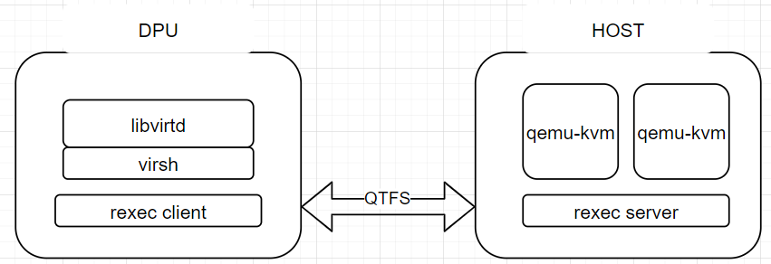

| 版本 | 时间      | 作者 | 内容                                                         |
| ---- | --------- | ---- | ------------------------------------------------------------ |
| V1.0 | 2022/12/5 | 李强 | 创建文档                                                     |
| V1.1 | 2023/2/6  | 李强 | 增加uds proxy组件部署介绍；增加rexec组件部署介绍；修改libvirt相关描述，适配uds proxy组件。 |
| V1.2 | 2023/3/22 | 李强 | rexec重构后，更新rexec组件部署说明。                           |


# **1** 硬件准备

需准备2台物理机（虚机当前未试过），网络互通。

其中一台作为DPU模拟，另一台作为HOST模拟。在本文档中用DPU和HOST指代这两台服务器。


# **2** libvirt卸载架构图




# **3** 环境搭建

## **3.1** QTFS文件系统部署

可参考qtfs主页：https://gitee.com/openeuler/dpu-utilities/tree/master/qtfs

QTFS建联需要关闭防火墙。

## **3.2** UDSPROXYD服务部署

### 3.2.1 简介

udsproxyd是一个跨主机的unix domain socket代理服务，需要分别部署在host和dpu上，在host和dpu上的udsproxyd组件是对等的关系，可以实现分布在host与dpu上的2个进程之间的uds通信，通信进程是无感的，也就是说如果这两个进程在同一主机内通过uds正常通信的功能，拉远到host和dpu之间也可以，不需要做代码适配，只需要作为client的一端加一个环境变量`LD_PRELOAD=libudsproxy.so`。

### 3.2.2 部署方式

首先，在dpu-utilities工程内编译udsproxyd：

```bash
cd qtfs/ipc

make && make install
```

当前最新版本下，qtfs server侧的engine服务已经整合了udsproxyd的能力，所以server侧若部署了qtfs后不需要再额外启动udsproxyd。client侧则单独拉起udsproxyd服务：

`nohup /usr/bin/udsproxyd <thread num> <addr> <port> <peer addr> <peer port> 2>&1 &`

参数解释：

```
thread num: 线程数量，目前只支持单线程，填1.

addr: 本机使用的ip

port：本机占用的port

peer addr: udsproxyd对端的ip

peer port: 对端port
```

示例：

`nohup /usr/bin/udsproxyd 1 192.168.10.10 12121 192.168.10.11 12121 2>&1 &`

如果未拉起qtfs的engine服务，想单独测试udsproxyd，则在server端也对等拉起udsproxyd即可：`nohup /usr/bin/udsproxyd 1 192.168.10.11 12121 192.168.10.10 12121 2>&1 &`

然后将libudsproxy.so拷贝到libvirt的chroot目录下的/usr/lib64中以提供给libvirtd服务使用，这一步在后面介绍。

## **3.3** REXEC服务部署

### 3.3.1 简介

rexec是一个用c语言开发的远程执行组件，分为rexec client和rexec server。server端为一个常驻服务进程，client端为一个二进制文件，client端被执行后会基于udsproxyd服务与server端建立uds连接，并由server常驻进程在server端拉起指定程序。在libvirt虚拟化卸载中，libvirtd卸载到DPU上，当它需要在HOST拉起虚拟机qemu进程时调起rexec client进行远程拉起。


### 3.3.2 部署方法

#### 3.3.2.1 配置环境变量与白名单

在host侧配置rexec server的白名单，将文件whitelist放置在/etc/rexec/目录下： [whitelist](./config/whitelist)。并修改权限为只读：

```
chmod 400 /etc/rexec/whitelist。
```
如果想仅用于测试，可以不进行白名单配置，删除此文件重启rexec_server进程后则没有白名单限制。

下载dpu-utilities代码后，进入qtfs/rexec主目录下，执行：`make && make install`即可安装rexec所需全部二进制到/usr/bin目录下，包括了：`rexec、rexec_server`两个二进制可执行文件。

在server端启动rexec_server服务之前，检查是否存在/var/run/rexec目录，没有则创建：
```
mkdir /var/run/rexec
```

server端可以通过两种方式拉起rexec_server服务：

#### 3.3.2.2 方式1，配置systemd服务

在/usr/lib/systemd/system/下增加rexec.service文件，内容如下：

[rexec.service](./config/rexec.service)

然后通过systemctl管理rexec服务。

首次配置服务时：

```
systemctl daemon-reload

systemctl enable --now rexec
```


后续重启新启动服务：

```
systemctl stop rexec

systemctl start rexec
```

#### 3.3.2.3 方式2，手动后台拉起

`nohup /usr/bin/rexec_server 2>&1 &`

## **3.4** libvirt服务部署

### 3.4.1 HOST侧部署

HOST无需额外部署，只需要安装虚拟机启动环境以及libvirt即可（安装libvirt主要是为了创建对应的目录）：`yum install -y qemu libvirt edk2-aarch64(arm环境虚机启动需要)`。

HOST需要放置虚拟机镜像，后面通过qtfs挂载到client端共享给libvirt。


### 3.4.2 DPU侧部署

#### 3.4.2.1 创建chroot环境：

a) 从openEuler官网下载qcow镜像，例如2203LTS版本https://repo.openeuler.org/openEuler-22.03-LTS/virtual_machine_img/。

b) 将qcow2挂载出来：

```

i. cd /root/

ii. mkdir p2 new_root_origin new_root

iii. modprobe nbd maxport=8

iv. qemu-nbd -c /dev/nbd0 xxx.qcow2

v. mount /dev/nbd0p2 /root/p2

vi. cp -rf /root/p2/* /root/new_root_origin/

vii. umount /root/p2

viii. qemu-nbd -d /dev/nbd0
```

c) 此时new_root_origin有解压出来的镜像根目录，再将new_root绑定挂载到该目录上，作为chroot的根目录挂载点：`mount --bind /root/new_root_origin /root/new_root`。

#### 3.4.2.2 配置chroot环境，安装libvirt，此处介绍patch方式源码编译，如果计算提供rpm包则参考计算提供的安装方法：

a) 进入chroot环境，安装编译环境和常用工具：`yum groupinstall "Development tools" -y；yum install -y vim meson qemu qemu-img strace edk2-aarch64 tar`。其中edk2-aarch64是arm环境下虚机启动需要的。

b) 安装libvirt编译需要的依赖包：`yum install -y rpcgen python3-docutils glib2-devel gnutls-devel libxml2-devel libpciaccess-devel libtirpc-devel yajl-devel systemd-devel dmidecode glusterfs-api numactl`

c) 下载libvirt-6.9.0源码包：https://libvirt.org/sources/libvirt-6.9.0.tar.xz。

d) 获取直连聚合libvirt patch：

https://gitee.com/openeuler/dpu-utilities/tree/master/usecases/transparent-offload/patches/libvirt

e) 将源码包解压到chroot环境下的目录，如/home。将patch打上。

f) 进入libvirt-6.9.0目录，`meson build --prefix=/usr -Ddriver_remote=enabled -Ddriver_network=enabled -Ddriver_qemu=enabled -Dtests=disabled -Ddocs=enabled -Ddriver_libxl=disabled -Ddriver_esx=disabled -Dsecdriver_selinux=disabled -Dselinux=disabled`。

g) 成功以后，`ninja -C build install`即安装成功。

#### 3.4.2.3 启动libvirtd服务。

libvirt直连聚合卸载模式，需要从chroot内启动libvirtd服务，首先需要把chroot之外的libvirtd服务停掉。

a) 放置虚机跳板脚本在chroot环境下的/usr/bin和/usr/libexec下：[qemu-kvm](./scripts/qemu-kvm)。替换原同名二进制，这个跳板脚本就是用于调用rexec拉起远端虚机。注意，virsh使用的xml中，<devices>下面的<emulator>需要填qemu-kvm，如果是填的其他，则需要修改为qemu-kvm，或者将跳板脚本替换<emulator>指代的二进制，且跳板脚本内容需要对应地更改。

b) 将udsproxyd编译时附带产生的libudsproxy.so拷贝到本chroot目录下/usr/lib64下。

c) 将前面rexec编译产生的rexec二进制放置到本chroot的/usr/bin/目录下。

d) 配置chroot的挂载环境，需要挂载一些目录，使用如下配置脚本，其中virt_start.sh为配置脚本，virt_umount.sh为消除配置脚本： [virt_start.sh](./scripts/virt_start.sh), [virt_umount.sh](./scripts/virt_umount.sh)。virt_start.sh脚本中需要手动修改qtfs ko dir为编译的ko位置，host ip address为正确的host地址。

e) 脚本中挂载目录位置都是按照本文档前文创建目录位置与名称为准，如果有修改需要同步适配修改脚本。

f) 配置好chroot环境后，进入chroot环境，手动拉起libvirtd：

```
LD_PRELOAD=/usr/lib64/libudsproxy.so virtlogd -d；

LD_PRELOAD=/usr/lib64/libudsproxy.so libvirtd -d。
````


## **3.5** 拉起虚机

服务部署完成后，即可以在DPU侧进行虚机的生命周期管理。

### 3.5.1 虚拟机define

a) 将虚机启动镜像放置在HOST侧某目录，例如`/home/VMs/Domain_name`。

b) 使用qtfs将这个目录挂载到DPU侧：`mount -t qtfs /home/VMs /home/VMs`。

c) xml中使用`/home/VMs/Domain_name`作为启动镜像，这样在DPU和HOST侧看到的都是同一个镜像文件。（Domain_name是虚机domain的名字）。

d) 检查xml中<emulator>是否指向了跳板脚本。

e) 执行`virsh define xxx.xml`。


### 3.5.2 虚机start

```
virsh start domain
```


# **4** 环境重置

由于libvirt在DPU和HOST之间共享了部分目录，卸载环境时需要先将这部分目录全部umount。一般先停掉libvirtd和virtlogd进程，调用virt_umount脚本即可。如果HOST还有虚机运行，也需要先杀掉才能umount。


# **5** 部分问题定位思路

1、 libvirt编译失败：检查依赖包安装是否完全，如果chroot挂载了外部目录或者host目录，也可能导致编译失败，需先解除挂载。

2、 QTFS挂载失败：可能server端engine进程没拉起、防火墙没关导致qtfs建联失败。

3、 虚机define失败：检查xml里的项目仿真器是否指向跳板脚本、虚机镜像是否已经通过qtfs挂载到DPU上可见，且路径与HOST一致。

4、 虚机启动失败：libvirtd和virtlogd服务是否拉起、rexec服务是否拉起、跳板进程是否拉起、是否qemu-kvm拉起时报错。
